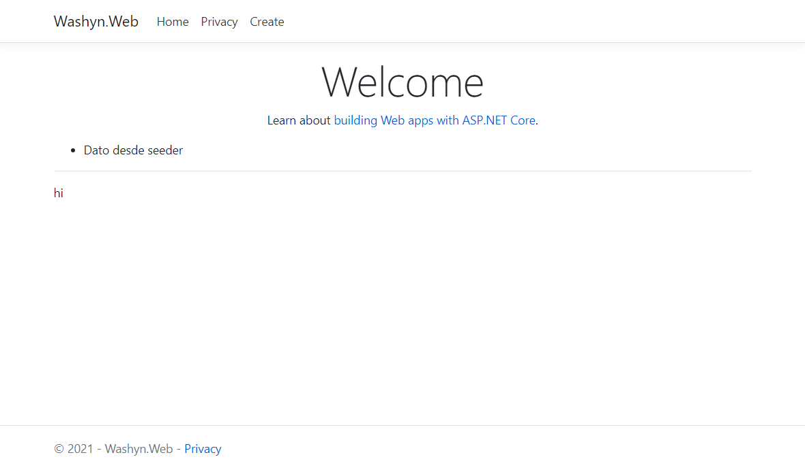

# Abp as aspnetboilerplate, with 4 layers
This is one soluction create fron scratch about example of use abp framework as traditional way(aspnetboilerplate) with 4 layers.

## Examples
- Add bundle generation
- create proxy scripts

## TODO
- Disable proxy generation, for all by default and only add this with RemoteService decorator
- Improve readme descripcion
- Steps for run app

## NOTES: 
Theme shared contains all basic js libs, basic theme add layout.js and layout.css file for fix some ui components.